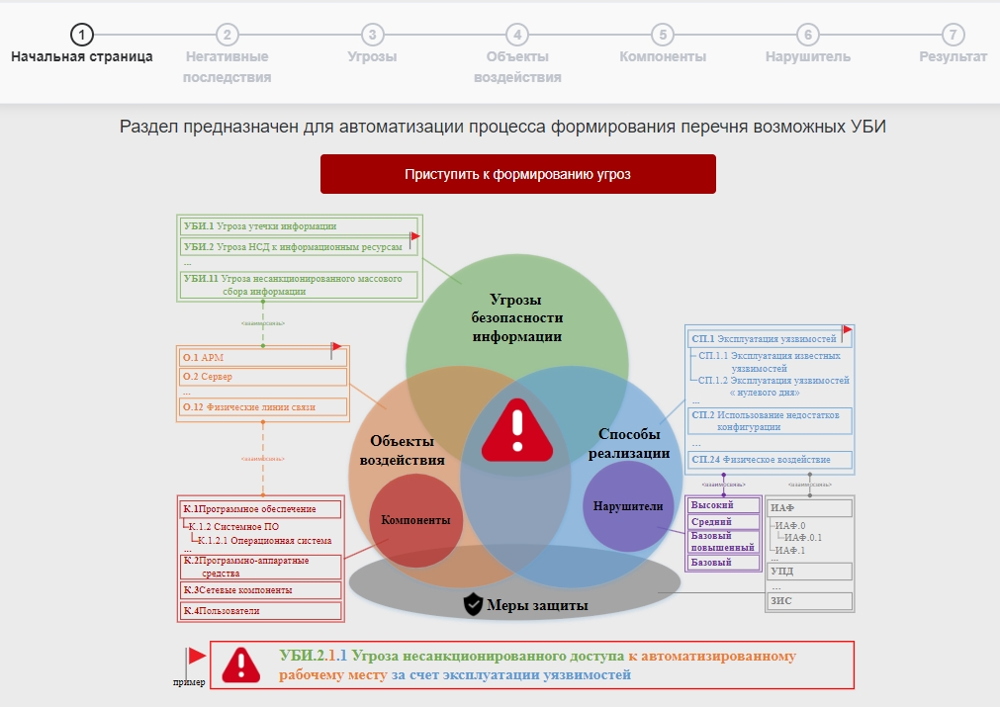
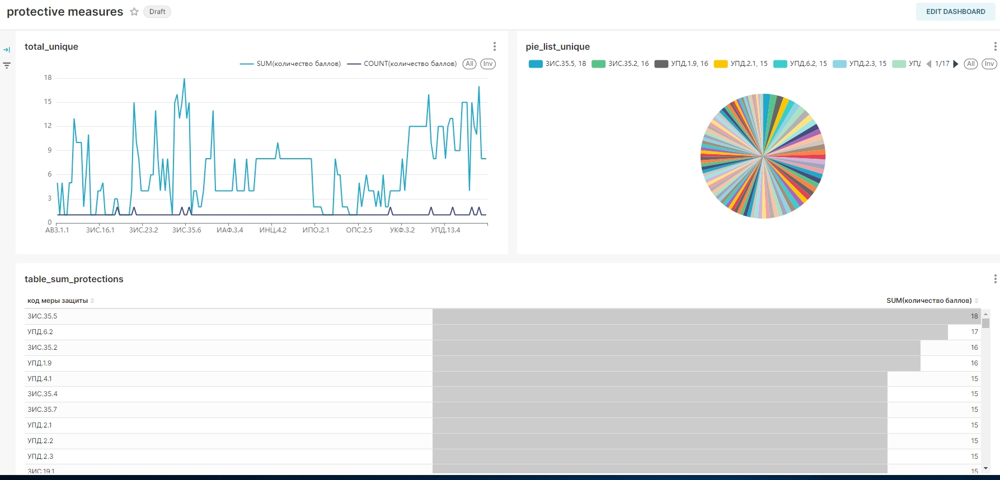
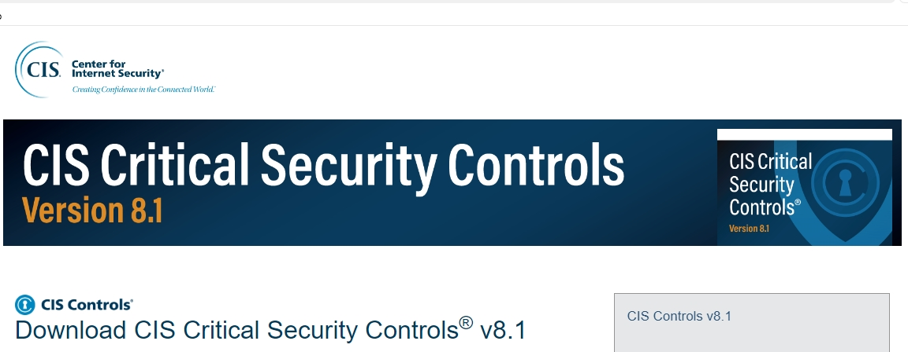
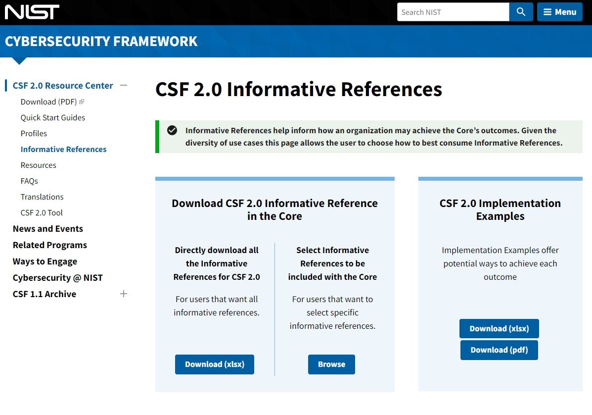

# HW2. Моделирование угроз и выбор мер защиты

## Задание:

1. Используя полученный в ходе выполнения файл XLSX/CSV-файла «Перечень сформированных угроз», сформируйте перечень уникальных мер защиты, подсчитав вклад каждой меры в нейтрализацию соответствующего способа реализации угрозы (+1 балл). Отсортируйте полученный перечень по убыванию в части полученных баллов. Можно сделать с использованием Microsoft Excel, Google Sheets или написать обработчик CSV-файла на Python.

2. Доп. задание: сделайте маппинг полученных мер с мерами из CIS Controls и/или NIST Cybersecurity Framework (CSF) там, где это возможно.
   Направьте ответ в табличном формате с использованием Google Docs (GitHub):

- код меры защиты;
- наименование меры защиты;
- количество баллов;
- наименование меры на английском языке из CIS Controls (опционально);
- наименование меры на английском языке из NIST CSF (опционально).\_\*\*

---

1. С использованием инструментария FSTEC of Russia получим перечень угроз, сформированный на основе негативного последствия H.30:

   https://bdu.fstec.ru/threat-section/shaper-threats

   

   [«Перечень сформированных угроз FSTEC of Russia»](./HW2-list_threats_generated_FSTEC%20of%20Russia.xlsx)

   С использованием Python выполним агрегацию мер защиты по критерию уникальности:

   **[«Перечень уникальных мер защиты FSTEC of Russia»](./HW2-list_unique_protections_FSTEC%20of%20Russia.xlsx)**

   

   2.1) Используем ресурс центра интернет-безопасности CIS (Critical Security Controls) <https://learn.cisecurity.org/cis-controls-download>

   

   **[«Перечень мер защиты CIS Controls v8»](./HW2-CIS_Controls_v8_Change_Log.xlsx)**

   ***

   2.2) Используем NIST Cybersecurity Framework (Национального института стандартов и технологий США):

   <https://www.nist.gov/informative-references>

   

   **[«Перечень мер NIST CSF 2.0»](./HW2-NIST_csf2.xlsx)**

   ***

### Результат маппинга таблиц:

- перечень уникальных мер защиты FSTEC of Russia;
- перечень мер защиты CIS Controls v8;
- перечень мер NIST CSF 2.0:

  **[«Маппинг мер FSTEC/ CIS/ NIST](./HW2_list_unique_protections_FSTEC%20of%20Russia_vs_CIS_&_NIST.xlsx)**

---
